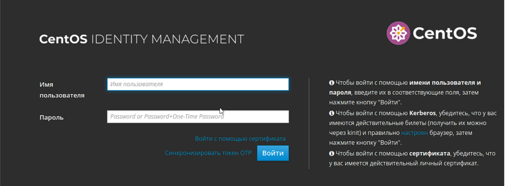
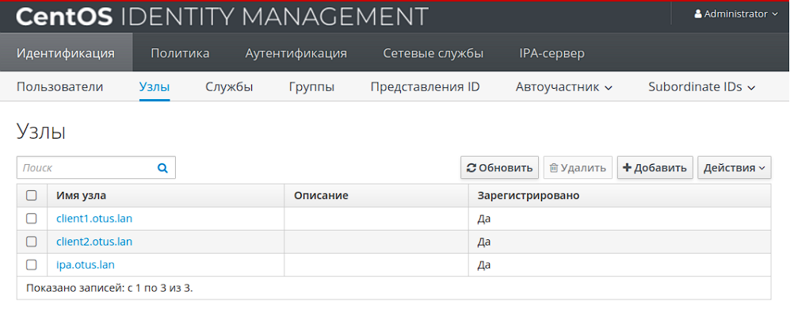

# LDAP
LDAP. Централизованная авторизация и аутентификация 
## Цель домашнего задания
* Научиться настраивать LDAP-сервер и подключать к нему LDAP-клиентов
1. После создания Vagrantfile, запустим виртуальные машины командой vagrant up. Будут созданы 3 виртуальных машины
2. **Установка FreeIPA сервера.** Для начала нам необходимо настроить FreeIPA-сервер. Подключимся к нему по SSH с помощью команды: ``` vagrant ssh ipa.otus.lan ``` и перейдём в root-пользователя:``` sudo -i ``` 
3. Начнем настройку FreeIPA-сервера:
* Установим часовой пояс:``` timedatectl set-timezone Europe/Samara ```
* Установим утилиту chrony:``` yum install -y chrony ```
* Запустим chrony и добавим его в автозагрузку:``` systemctl enable chronyd ```
* Выключим Firewall:``` systemctl stop firewalld ```
* Отключаем автозапуск Firewalld:``` systemctl disable firewalld ```
* Остановим Selinux:``` setenforce 0 ```
* Поменяем в файле /etc/selinux/config, параметр Selinux на disabled ``` nano /etc/selinux/config ```
```
...
#    grubby --update-kernel ALL --remove-args selinux
#
SELINUX=disabled
# SELINUXTYPE= can take one of these three values:
#     targeted - Targeted processes are protected,
#     minimum - Modification of targeted policy. Only selected processes are protected.
#     mls - Multi Level Security protection.
SELINUXTYPE=targeted
``` 
* Для дальнейшей настройки FreeIPA нам потребуется, чтобы DNS-сервер хранил запись о нашем LDAP-сервере. Для данной работы настраивать DNS-сервер не будем, а просто внесем изменения в файл /etc/hosts
```
[root@ipa ~]# cat /etc/hosts
127.0.0.1   localhost localhost.localdomain localhost4 localhost4.localdomain4
::1         localhost localhost.localdomain localhost6 localhost6.localdomain6
127.0.1.1 ipa.otus.lan ipa
192.168.57.10 ipa.otus.lan ipa
```
* Установим FreeIPA-сервер: ``` yum install -y ipa-server ```
* Запустим скрипт установки:``` ipa-server-install ```
4. Далее, нам потребуется указать параметры нашего LDAP-сервера, после ввода каждого параметра нажимаем Enter, если нас устраивает параметр, указанный в квадратных скобках, то можно сразу нажимать Enter
```
Do you want to configure integrated DNS (BIND)? [no]: no
Server host name [ipa.otus.lan]: <Нажимаем Enter>
Please confirm the domain name [otus.lan]: <Нажимем Enter>
Please provide a realm name [OTUS.LAN]: <Нажимаем Enter>
Directory Manager password: <Указываем пароль минимум 8 символов>
Password (confirm): <Дублируем указанный пароль>
IPA admin password: <Указываем пароль минимум 8 символов>
Password (confirm): <Дублируем указанный пароль>
NetBIOS domain name [OTUS]: <Нажимаем Enter>
Do you want to configure chrony with NTP server or pool address? [no]: no
The IPA Master Server will be configured with:
Hostname:       ipa.otus.lan
IP address(es): 192.168.57.10
Domain name:    otus.lan
Realm name:     OTUS.LAN

The CA will be configured with:
Subject DN:   CN=Certificate Authority,O=OTUS.LAN
Subject base: O=OTUS.LAN
Chaining:     self-signed
Проверяем параметры, если всё устраивает, то нажимаем yes
Continue to configure the system with these values? [no]: yes
```
* При вводе параметров установки мы вводили 2 пароля. После успешной установки FreeIPA, проверим, что сервер Kerberos может выдать нам билет:

```
[root@ipa ~]# kinit admin
Password for admin@OTUS.LAN:
[root@ipa ~]# klist
Ticket cache: KCM:0
Default principal: admin@OTUS.LAN

Valid starting       Expires              Service principal
08/25/2024 12:16:48  08/26/2024 11:35:38  krbtgt/OTUS.LAN@OTUS.LAN
```
* Мы можем зайти в Web-интерфейс нашего FreeIPA-сервера, для этого на нашей хостой машине нужно прописать следующую строку в файле Hosts: ``` 192.168.57.10 ipa.otus.lan ```
5. 
6. Установка на клиентские хосты пакета ipa-client:
```
yum install -y ipa-client
```
7. Клиентский хост вводится в домен с помощью скрипта ipa-client-install, который необходимо запустить на каждом из них:
```
ipa-client-install --mkhomedir --domain=OTUS.LAN --server=ipa.otus.lan --no-ntp -p admin -w mypassword
```
8. 
9. Добавление нового пользователя в домен с аутентификацией по SSH-ключам:
```
echo "mypassword" | ipa user-add "user" --first="Otus" --last="Test" --shell="/bin/bash" --sshpubkey="ssh-rsa AAAAB3NzaC1yc2EAAAADAQABAAACAQCFy2yLxfS8beM+q0kwPtA6WjLISvz/rdkkNYxGCsZTBxLcnkzV2/XQM0PzVCSYJGiYZNMO1FR9e0cPFmvsuOSDZ/tYOdOb+aHTtjF9Z4xA7faaV7chbPqptAgtjeO6zt+KJ5U9N9NwVREiz3VBkxMJ9Yv4mRDvkuNd+ZndNdllpnzpYxUnpNTTJST1Hqk4SxCDOAFVPf9fwOA9J1V/UgfKGp9/xCpbeCMyY835h93sw5e7KBgWDtz6msSKwn0CBV2l15JD5r+lWUHBEuIE4QQjkh6ABM9oi19oeL5QTr3OGgyr6EXQA3QGYTYMWOO+/6c5PVtPRBIg/uYDy81dOlKERmOdF9UMiEJYQxSsVk5qGx8bKH2kXjNUG3Zhwmz6b9/6G+IQx3rsqr/u8k7BGt67/1RdkZk8Sz7sL2AcDsAhnRTwPUU+s80clxQLdo/lDQ/S2WKwnxbUWWkZiF23YPXQD/qvgr9Ik0KtYgDUcBbic12R4HxX7gLMX45wpNkojYGk+PjZo6xCshrrRJnVDAur1R4oP7+m+wl06W325gfBMk6x8+3odNSjkyAyYqSbUNqcOMNYjn6rcVl7wrDWu8crdjUoVzzOvN8puG+tXMxfqPrmo2OQiP2944R4QyiDeTTDluRtvAO+EDVKXdz0CdKprHYt5zDUXg3rJLCowe3U8w== root@ipa.otus.lan" --password
```
10. При включенном фаерволле, должно быть так:
```
firewall-cmd --permanent --add-service=http
firewall-cmd --permanent --add-service=https
firewall-cmd --permanent --add-service=ldap
firewall-cmd --permanent --add-service=ldaps
firewall-cmd --permanent --add-service=kerberos
firewall-cmd --permanent --add-service=kpasswd
firewall-cmd --permanent --add-service=dns
firewall-cmd --permanent --add-service=ntp
```


